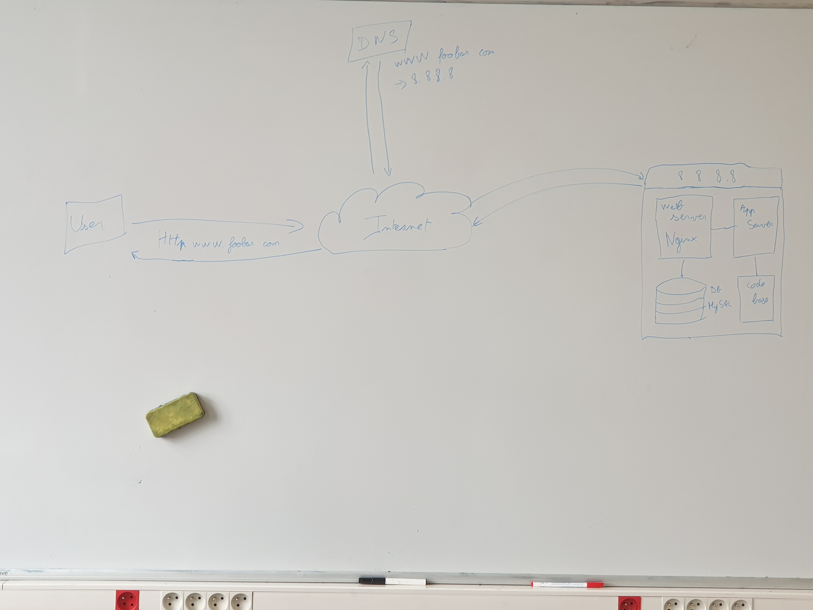
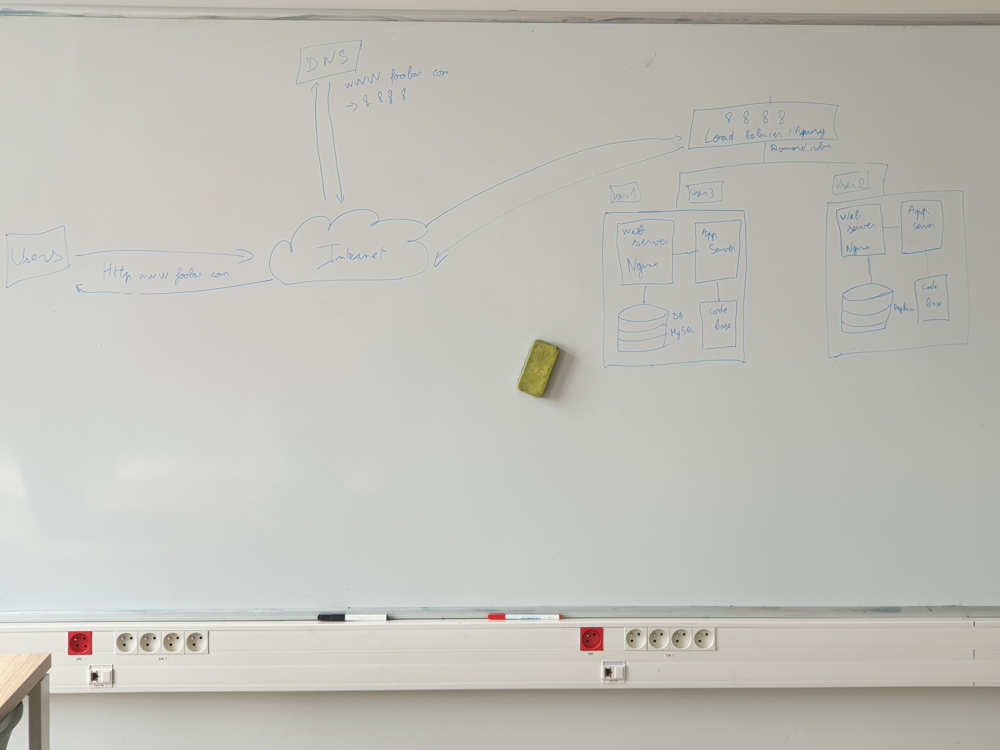
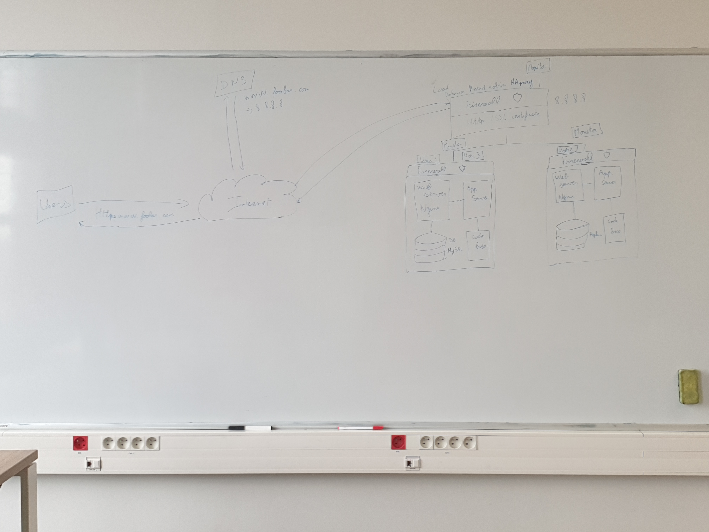
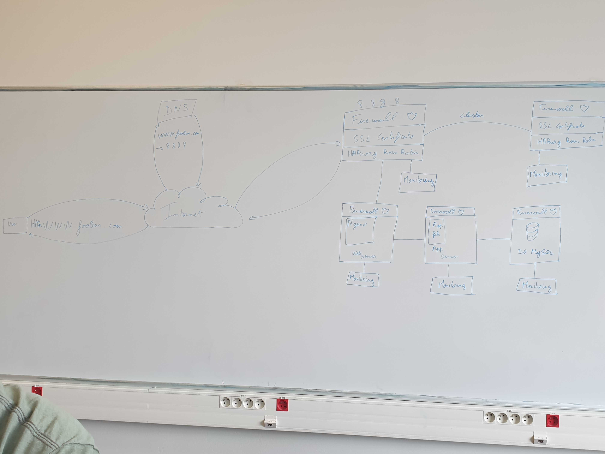

# **Project Web infrastructure design weekly 05/12/2025**

## <u>**0-simple_web_stack**</u>
### <u>Diagram</u>

### <u>Description</u>
* 1 domain name foobar.com configured with a www record that points to your server IP 8.8.8.8
* 1 server (containing the following):
	* 1 web server (Nginx)
	* 1 application server
	* 1 application files (your code base)
	* 1 database (MySQL)

### <u>Flow</u>
* The user makes a request for www.foobar.com in their browser.
* The browser checks the local cache to see if the IP for www.foobar.com exists; if it does not, it queries DNS to obtain the IP (e.g., 8.8.8.8).
* The browser sends an HTTP request via TCP/IP to the obtained IP address.
* Nginx handles the request on port 80.
* The app server processes the request, querying the MySQL database if needed.
* The server builds and sends the HTTP response to the user.
* The IP is stored in the local cache for subsequent requests until its TTL expires.

### <u>Question</u>
 What the issues are with this infrastructure?
<u>Single Point Of Failure(SPOF)</u>
There is only one server; if it fails, the website goes down.
<u>Downtime for maintenance</u>
When restarting services or deploying code updates, the website becomes unavailable.
<u>Scalability limits</u>
A single server cannot handle high traffic.

## <u>**1-distributed_web_infrastructure**</u>
### <u>Diagram</u>

### <u>Description</u>
* 1 load-balancer
	* HAproxy (Software)
	* Configured with Round Robin
* 2 servers (each containing the following)
	* 1 web server (Nginx)
	* 1 application server
	* 1 set of application files (your code base)
	* 1 database (MySQL (1 master and 1 slave in a read-only))

### <u>Flow</u>
* The user makes a request for www.foobar.com in their browser.
* The browser checks the local cache to see if the IP for www.foobar.com exists; if it does not, it queries DNS to obtain the IP (e.g., 8.8.8.8).
* The browser sends an HTTP request via TCP/IP to the obtained IP address.
* The request arrives at the load balancer on port 80, which forwards it to one of the servers in a round-robin fashion (an active-active setup distributes load evenly across all nodes).
* Nginx handles the request.
* The application server processes the request and queries the MySQL database if needed.
	* If it’s a read operation and the request is routed to a read replica, the query goes to the replica.
	* If it’s a write operation, the query is sent to the master database.
* The server builds and sends the HTTP response to the user.
* The IP is stored in the local cache for subsequent requests until its TTL expires.

### <u>Question</u>
What the issues are with this infrastructure?
<u>Single Point Of Failure(SPOF)</u>
If the load balancer goes down, no server can be reached. The MySQL master is the only writable database; if it's fails, all writes stop.
<u>Security issues</u>
No firewall, leaving servers exposed to unauthorized traffic, and without an SSL certificate, all data is sent in plaintext.
<u>No monitoring</u>
There’s no system to track uptime, performance, or logs, so failures or performance degradation go undetected.

## <u>**2-secured_and_monitored_web_infrastructure**</u>
### <u>Diagram</u>

### <u>Description</u>
* 1 load-balancer
	* HAproxy (Software)
	* Configured with Round Robin
	* 1 firewall
	* 1 SSL certificate
	* 1 monitor
* 2 servers (each containing the following)
	* 1 monitor
	* 1 firewall
	* 1 web server (Nginx)
	* 1 application server
	* 1 set of application files (your code base)
	* 1 database (MySQL (1 master and 1 slave in a read-only))

### <u>Flow</u>
* The user makes a request for www.foobar.com in their browser.
* The browser checks the local cache to see if the IP for www.foobar.com exists; if it does not, it queries DNS to obtain the IP (e.g., 8.8.8.8).
* The browser establishes a TCP connection to that IP on port 443 and sends an HTTPS request.
* The load balancer’s firewall permits inbound HTTPS (port 443) from any client, allows SSH (port 22) only from authorized IPs, and drops all other traffic.
* The load balancer terminates SSL/TLS, then in an active-active round-robin configuration forwards the HTTP request to one of the backend servers.
* HAProxy is tuned to handles a number of QPS per node, with alerts if average QPS by minute exceeds 3/4 QPS handles.
* A monitoring system collects health metrics, QPS, logs, and performance data from the load balancer and each server, triggering alerts on failures or resource saturation.
* Each server’s firewall allows HTTP (port 80) and SSH (port 22) only from authorized IPs, blocking all other ingress.
* Nginx on the selected server handles the HTTP request.
* The application server processes the request and queries the MySQL database if needed.
	* If it’s a read operation and the request is routed to a read replica, the query goes to the replica.
	* If it’s a write operation, the query is sent to the master database.
* The server builds and sends the HTPPS response to the user.
* The IP is stored in the local cache for subsequent requests until its TTL expires.

### <u>Question</u>
What the issues are with this infrastructure?
<u>Why terminating SSL at the load balancer level is an issue?</u>\
Because SSL is decrypted on the load balancer, traffic between the load balancer and server is unencrypted and exposing data on internal network.\
<u>Why having only one MySQL server capable of accepting writes is an issue?</u>\
The MySQL master is the only writable database; if it's fails, all writes , that created a SPOF.\
<u>Why having servers with all the same components (database, web server and application server) might be a problem</u>\

## <u>**3-scale_up**</u>
### <u>Diagram</u>

### <u>Description</u>
* 2 load-balancer in cluster (each containing the following)
	* HAproxy (Software)
	* Configured with Round Robin
	* 1 firewall
	* 1 SSL certificate
	* 1 monitor
* 3 servers
	* 1 web server (Nginx)
	* 1 application server, 1 set of application files (your code base)
	* 1 database in MySQL
	* each server containing the following:
		* 1 Firewall
		* 1 Monitor

### <u>Flow</u>
* The user makes a request for www.foobar.com in their browser.
* The browser checks the local cache to see if the IP for www.foobar.com exists; if it does not, it queries DNS to obtain the IP (e.g., 8.8.8.8).
* The browser establishes a TCP connection to that IP on port 443 and sends an HTTPS request.
* The load balancer’s firewall permits inbound HTTPS (port 443) from any client, allows SSH (port 22) only from authorized IPs, and drops all other traffic.
* The load balancer terminates SSL/TLS, then in an active-active round-robin configuration forwards the HTTP request to one of the backend servers.
* HAProxy is tuned to handles a number of QPS, with alerts if average QPS by minute exceeds 3/4 QPS handles.
* A monitoring system collects health metrics, QPS, logs, and performance data from the load balancer and each server, triggering alerts on failures or resource saturation.
* Server firewall allows HTTP (port 80) and SSH (port 22) only from authorized IPs, blocking all other ingress.
* Nginx on the selected server handles the HTTP request.
* The application server processes the request and queries the MySQL database if needed.
* The server builds and sends the HTPPS response to the user.
* The IP is stored in the local cache for subsequent requests until its TTL expires.